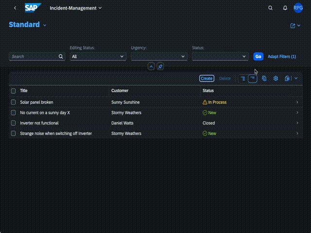

[](https://api.reuse.software/info/github.com/cap-js/notifications)

# Notifications Plugin

The `@cap-js/notifications` package is a [CDS plugin](https://cap.cloud.sap/docs/node.js/cds-plugins#cds-plugin-packages) that provides support for publishing business notifications in SAP Build WorkZone.

### Table of Contents

- [Setup](#setup)
- [Send Notifications](#send-notifications)
- [Use Notification Types](#use-notification-types)
- [API Reference](#api-reference)
- [Test-drive Locally](#test-drive-locally)
- [Run in Production](#run-in-production)
- [Advanced Usage](#advanced-usage)
- [Contributing](#contributing)
- [Code of Conduct](#code-of-conduct)
- [Licensing](#licensing)

## Setup

To enable notifications, simply add this self-configuring plugin package to your project:

```sh
 npm add @cap-js/notifications
```

In this guide, we use the [Incidents Management reference sample app](https://github.com/cap-js/incidents-app) as the base, to publish notifications.

## Send Notifications

With that you can use the NotificationService as any other CAP Service like so in you event handlers:

```js
const alert = await cds.connect.to('notifications');
```

You can use the following signature to send the simple notification with title and description

```js
alert.notify({
  recipients: [ ...supporters() ],
  priority: "HIGH",
  title: "New high priority incident is assigned to you!",
  description: "Incident titled 'Engine overheating' created by 'customer X' with priority high is assigned to you!"
});
```

* **priority** - Priority of the notification, this argument is optional, it defaults to NEUTRAL
* **description** - Subtitle for the notification, this argument is optional

## Use Notification Types

### 1. Add notification types

If you want to send custom notifications in your application, you can add the notification types in the `srv/notification-types.json` file.

Sample: If you want to send the notification when the incident is resolved, you can modify the `srv/notification-types.json` as below:

```json
  [
    {
      "NotificationTypeKey": "IncidentResolved",
      "NotificationTypeVersion": "1",
      "Templates": [
        {
          "Language": "en",
          "TemplatePublic": "Incident Resolved",
          "TemplateSensitive": "Incident '{{title}}' Resolved",
          "TemplateGrouped": "Incident Status Update",
          "TemplateLanguage": "mustache",
          "Subtitle": "Incident from '{{customer}}' resolved by {{user}}."
        }
      ]
    }
  ]
```

### 2. Use pre-defined types in your code like that:

```js
  await alert.notify ('IncidentResolved', {
    recipients: [ customer.id ],
    data: {
      customer: customer.info,
      title: incident.title,
      user: cds.context.user.id,
    }
  })
```

## API Reference

* **recipients** - List of the recipients, this argument is mandatory
* **type** - Notification type key, this argument is mandatory
* **priority** - Priority of the notification, this argument is optional, it defaults to NEUTRAL
* **data** - A key-value pair that is used to fill a placeholder of the notification type template, this argument is optional

## Test-drive Locally
In local environment, when you publish notification, it is mocked to publish the nofication to the console.


## Run in Production

#### Notification Destination

As a pre-requisite to publish the notification, you need to have a [destination](https://help.sap.com/docs/build-work-zone-standard-edition/sap-build-work-zone-standard-edition/enabling-notifications-for-custom-apps-on-sap-btp-cloud-foundry#configure-the-destination-to-the-notifications-service) configured to publish the notification. In the `package.json` by default destination name `SAP_Notifications` is added, you can modify the destination name that you are configuring.

#### Integrate with SAP Build Work Zone

Once application is deployed and integrated with SAP Build Work Zone, you can see the notification under fiori notifications icon!




## Advanced Usage

### Custom Notification Types Path

Notifications plugin configures `srv/notification-types.json` as default notification types file. If you are using different file, you can update the file path in `cds.env.requires.notifications.types` 

### Custom Notification Type Prefix

To make notification types unique to the application, prefix is added to the type key. By default, `application name` is added as the prefix. You can update the `cds.env.requires.notifications.prefix` if required.

### Authentication Identifier

Depending on your Work Zone Notifications configuration, set `cds.env.requires.notifications.authenticationIdentifier` to `UserUUID` if the authenciation identifier in Work Zone is set to `User ID`. Notifications are then published with Recipient Key `GlobalUserId` instead of `RecipientId`. If not set, `RecipientId` is used. Note, that in order for E-Mail Notifications to be sent for notifications published with a User ID, a destination to the IDS needs to be configured for the lookup of the corresponding email address.

For the Work Zone Authentication Identifier configuration details refer to: [Work Zone Subaccount Settings](https://help.sap.com/docs/build-work-zone-standard-edition/sap-build-work-zone-standard-edition/subaccount-settings)

### Low-level  Notifications API

You can use these two signature to send the custom notification with pre-defined notification types.

#### With pre-defined parameters

By using this approach you can send notifications with the predefined parameters - recipients, data, priority, type and other parameters listed in the [API documentation](https://help.sap.com/docs/build-work-zone-standard-edition/sap-build-work-zone-standard-edition/developing-cloud-foundry-applications-with-notifications) 

```js
alert.notify({
  recipients: [...supporters()],
  type: "IncidentResolved",
  priority: 'NEUTRAL',
  data: {
    customer: customer.info,
    title: incident.title,
    user: cds.context.user.id,
  },
  OriginId: "Example Origin Id",
  NotificationTypeVersion: "1",
  ProviderId: "/SAMPLEPROVIDER",
  ActorId: "BACKENDACTORID",
  ActorDisplayText: "ActorName",
  ActorImageURL: "https://some-url",
  NotificationTypeTimestamp: "2022-03-15T09:58:42.807Z",
  TargetParameters: [
    {
      "Key": "string",
      "Value": "string"
    }
   ]
  });
```

#### Passing the whole notification object

By using this approach you need to pass the whole notification object as described in the [API documentation](https://help.sap.com/docs/build-work-zone-standard-edition/sap-build-work-zone-standard-edition/developing-cloud-foundry-applications-with-notifications)

```js
alert.notify({
  NotificationTypeKey: 'IncidentCreated',
  NotificationTypeVersion: '1',
  Priority: 'NEUTRAL',
  Properties: [
    {
      Key: 'name',
      IsSensitive: false,
      Language: 'en',
      Value: 'Engine overheating',
      Type: 'String'
    },
    {
      Key: 'customer',
      IsSensitive: false,
      Language: 'en',
      Value: 'Dave',
      Type: 'String'
    }
  ],
  Recipients: [{ RecipientId: "supportuser1@mycompany.com" },{ RecipientId: "supportuser2@mycompany.com" }]
});
```

## Contributing

This project is open to feature requests/suggestions, bug reports etc. via [GitHub issues](https://github.com/cap-js/change-tracking/issues). Contribution and feedback are encouraged and always welcome. For more information about how to contribute, the project structure, as well as additional contribution information, see our [Contribution Guidelines](CONTRIBUTING.md).

## Code of Conduct

We as members, contributors, and leaders pledge to make participation in our community a harassment-free experience for everyone. By participating in this project, you agree to abide by its [Code of Conduct](CODE_OF_CONDUCT.md) at all times.

## Licensing

Copyright 2023 SAP SE or an SAP affiliate company and contributors. Please see our [LICENSE](LICENSE) for copyright and license information. Detailed information including third-party components and their licensing/copyright information is available [via the REUSE tool](https://api.reuse.software/info/github.com/cap-js/change-tracking).
