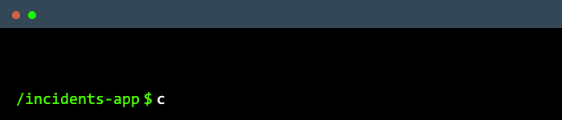
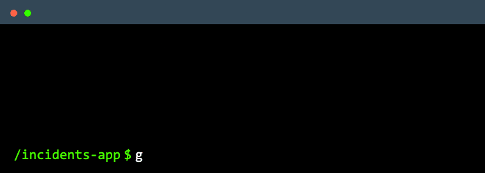
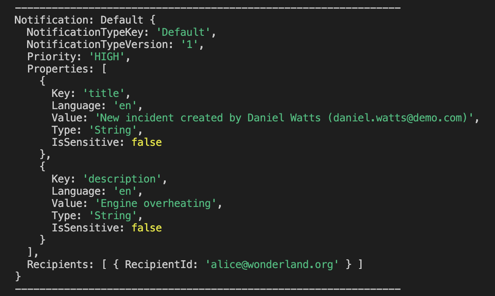

The `@cap-js/notifications` package is a [CDS plugin](https://cap.cloud.sap/docs/node.js/cds-plugins#cds-plugin-packages) providing out-of-the box support for publishing business notifications.

### Table of Contents

- [Setup](#setup)
- [Usage](#usage)
  - [Update Notification Configuration](#update-notification-configuration)
    - [Notification Destination](#notification-destination)
    - [Notification Types Path](#notification-types-path)
  - [Add Notification Types](#add-notification-types)
  - [Update handlers to publish notification](#update-handlers-to-publish-notification)
    - [Simple Notificaiton with title](#simple-notificaiton-with-title)
    - [Simple Notificaiton with title & description](#simple-notificaiton-with-title)
    - [Custom Notifications with notification types](#simple-notificaiton-with-title)
  - [Sample Application with notifications](#sample-application-with-notifications)
    - [In Local Environment](#in-local-environment)
    - [In Production Environment](#in-production-environment)
- [Contributing](#contributing)
  - [Code of Conduct](#code-of-conduct)
- [Licensing](#licensing)

## **Setup**

To enable notifications, simply add this self-configuring plugin package to your project:

```sh
 cds add notifications 
```



## **Usage**

In this guide, we use the [Incidents Management reference sample app](https://github.com/cap-js/incidents-app) as the base, to publish notifications.

### **Update Notification Configuration**

`cds add notifications` will add default configurations for notifications in the `package.json` file.



#### **Notification Destination**

As a pre-requisite to publish the notification, you need to have a destination configured with ANS to publish the notification. In the `package.json` by default destination name `SAP_Notification` is added, you can modify the destination name that you are configuring.

#### **Notification Types Path**

When you run `cds add notifications`, it will add `notificationstype.json` file with template for a notification type in the project root folder.  You can add the notification types in the `notificationtype.json` file for sending the custom notification types.

#### **Notification Type Prefix**

To make notification types unique to the application, prefix is added to the type key. By default, `application name` is added as the prefix. You can update the `prefix` if required.

### **Add Notification Types**

If you want to send custom notifications in your application, you can add the notification types in the `notificationtype.json` file.

Sample: If you want to send the notification when the new incident is reported, you can modify the `notificationtypes.json` as below:

```jsonc
[
  {
    "NotificationTypeKey": "IncidentReported",
    "NotificationTypeVersion": "1",
    "Templates": [
      {
        "Language": "en",
        "TemplatePublic": "Incident Reported",
        "TemplateSensitive": "Incident '{{name}}' Reported",
        "TemplateGrouped": "New Incidents",
        "TemplateLanguage": "mustache",
        "Subtitle": "Incident '{{name}}' reported by '{{customer}}'."
      }
    ]
  }
]
```

### Update handlers to publish notification

In the handler files, connect to the notifications plugin by:
   
```js
const alert = await cds.connect.to('notifications');
```

#### **Simple Notificaiton with title**
You can use the following signature to send the simple notification with title
```js
alert.notify({
  recipients: recipients,
  priority: priority,
  title: title
});
```
#### **Simple Notificaiton with title & description**
You can use the following signature to send the simple notification with title and description
```js
alert.notify({
  recipients: recipients,
  priority: priority,
  title: title,
  description: description
});
```
#### **Custom Notifications with notification types**
You can use the following signature to send the custom notification with pre-defined notification types.
```js
alert.notify({
  NotificationTypeKey: 'IncidentCreated',
  NotificationTypeVersion: '1',
  Priority: 'NEUTRAL',
  Properties: [
    {
      Key: 'name',
      IsSensitive: false,
      Language: 'en',
      Value: 'Engine overheating',
      Type: 'String'
    },
    {
      Key: 'customer',
      IsSensitive: false,
      Language: 'en',
      Value: 'John',
      Type: 'String'
    }
  ],
  Recipients: recipients
});
```

### Sample Application with notifications

#### **In Local Environment**
In local environment, when you publish notification, it is mocked to publish the nofication to the console.



#### **In Production Environment**

Once application is deployed and integrated with SAP Build Work Zone, you can see the notification under fiori notifications icon!

## Contributing

This project is open to feature requests/suggestions, bug reports etc. via [GitHub issues](https://github.com/cap-js/change-tracking/issues). Contribution and feedback are encouraged and always welcome. For more information about how to contribute, the project structure, as well as additional contribution information, see our [Contribution Guidelines](CONTRIBUTING.md).


### Code of Conduct

We as members, contributors, and leaders pledge to make participation in our community a harassment-free experience for everyone. By participating in this project, you agree to abide by its [Code of Conduct](CODE_OF_CONDUCT.md) at all times.


## Licensing

Copyright 2023 SAP SE or an SAP affiliate company and contributors. Please see our [LICENSE](LICENSE) for copyright and license information. Detailed information including third-party components and their licensing/copyright information is available [via the REUSE tool](https://api.reuse.software/info/github.com/cap-js/change-tracking).


