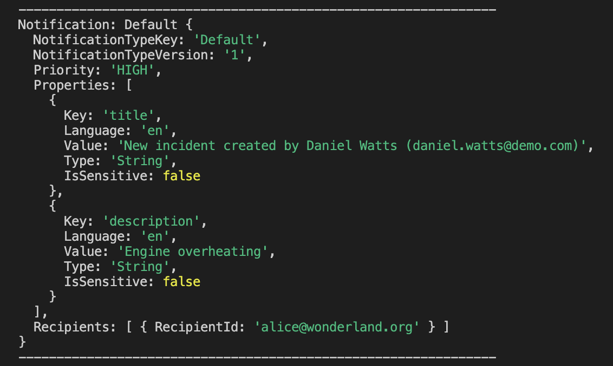
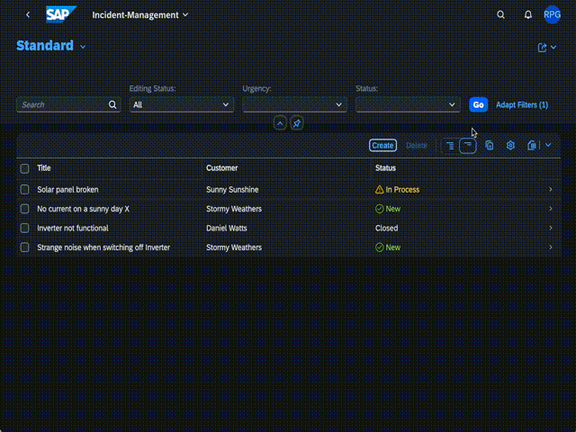

[](https://api.reuse.software/info/github.com/cap-js/notifications)

# Notifications Plugin

The `@cap-js/notifications` package is a [CDS plugin](https://cap.cloud.sap/docs/node.js/cds-plugins#cds-plugin-packages) that provides support for publishing business notifications in SAP Build Work Zone.

### Table of Contents

- [Setup](#setup)
- [Getting Started](#getting-started)
- [Define Notification Types](#define-notification-types)
- [Send Notifications](#send-notifications)
- [API Reference](#api-reference)
- [Test-drive Locally](#test-drive-locally)
- [Run in Production](#run-in-production)
- [Advanced Usage](#advanced-usage)
  - [Custom Notification Types Path](#custom-notification-types-path)
  - [Custom Notification Type Prefix](#custom-notification-type-prefix)
  - [Custom Destination Name](#custom-destination-name)
  - [Authentication Identifier](#authentication-identifier)
  - [Default Email Delivery](#default-email-delivery)
  - [Outbox Behavior](#outbox-behavior)
  - [Debug Logging](#debug-logging)
  - [Low-level Notifications API](#low-level-notifications-api)
- [Contributing](#contributing)
- [Code of Conduct](#code-of-conduct)
- [Licensing](#licensing)


## Setup

**Requirements:** Node.js >= 20, `@sap/cds` >= 8.

To enable notifications, simply add this self-configuring plugin package to your project:

```sh
npm add @cap-js/notifications
```

In this guide, we use the [Bookshop reference sample app](https://github.com/capire/bookshop) as the basis for publishing notifications.


## Getting Started

This section uses the Bookshop sample included in this repository. Everything is already wired up, you just need to run it, trigger a notification, and then make a change to see how the plugin responds.

### 1. Run the sample app

```sh
cd tests/bookshop
npm install
cds watch
```

The server starts at `http://localhost:4004`. In development mode the plugin is active and notifications are printed to the console, no BTP account needed yet.

### 2. Trigger a notification

The bookshop's `submitOrder` action reduces book stock and emits a `BookOrderedNotify` event. The plugin intercepts that event and sends a notification.

Open `tests/bookshop/test/http/CatalogService.http` in VS Code and click **Send Request** above the `submitOrder` block. This file has the server URL and credentials pre-configured.

In the server console you will see the notification printed:

```
---------------------------------------------------------------
Notification: BookOrderedNotify {
  NotificationTypeKey: 'bookshop/BookOrderedNotify',
  Priority: 'LOW',
  Recipients: [ { RecipientId: 'reader@bookshop.example' } ],
  Properties: [ { Key: 'title', Value: 'Wuthering Heights' }, ... ]
}
---------------------------------------------------------------
```

The priority is `LOW` because the order quantity (1) did not exceed the threshold of 5. Change `"quantity"` to `10` in the `.http` file, send again, and it becomes `HIGH`.

### 3. Customize the notification type

Open `tests/bookshop/srv/notifications.cds`. This file defines the `BookOrderedNotify` event and all of its `@notification` annotations. Change the subtitle template to include the quantity:

```cds
// Before
subtitle: '{i18n>BOOK_ORDERED_SUBTITLE}',

// After
subtitle: '{{buyer}} ordered {{quantity}}x {{title}}',
```

Save the file and `cds watch` reloads automatically. Send the request again and the updated subtitle appears in the console output. From here, try adjusting the priority expression, adding a `@description`, or exploring the other annotations on the event.

### 4. Connect to SAP Build Work Zone

To see the notification appear in the Work Zone bell icon, you need a BTP subaccount with SAP Build Work Zone and the SAP Alert Notification service configured.

1. Follow the [SAP Build Work Zone setup guide](https://help.sap.com/docs/build-work-zone-standard-edition/sap-build-work-zone-standard-edition/enabling-notifications-for-custom-apps-on-sap-btp-cloud-foundry) to subscribe to the service and configure the required `SAP_Notifications` destination in your subaccount.
2. Bind your local environment to the destination service instance in CF using `cds bind`, then run `cds watch --profile hybrid` to connect to BTP destinations from your local machine.

On startup the plugin registers your notification types automatically. Submitting an order will now deliver a notification to the Work Zone bell for the recipient.

> **Note:** The bookshop sample uses in-app (bell) notifications by default. The Work Zone bell shows notifications for recipients identified by their SAP BTP Global User ID (UUID). If you want to test email delivery as well, that requires additional setup. See [Email delivery](#email-delivery) and [Default Email Delivery](#default-email-delivery) for how to enable it, and the [SMTP mail destination guide](https://help.sap.com/docs/build-work-zone-standard-edition/sap-build-work-zone-standard-edition/configuring-smtp-mail-destination) for the BTP configuration required.


## Define Notification Types

Notifications are based on *notification types* - templates that define how a notification looks, including titles, subtitles, and email content. There are two ways to define them. Both can be used together and are merged at startup.

### Option A: CDS Annotations (recommended)

The recommended approach is to annotate CDS events in your service model with `@notification`. The plugin discovers them at startup and registers them automatically, no separate file is needed.

Define an event in your `srv/` model:

```cds
using { CatalogService } from './cat-service';

extend service CatalogService with {

  @description: 'Sent when a book is ordered'
  @notification: {
    template: {
      title        : 'Book {{title}} Ordered',
      publicTitle  : 'Book Ordered',
      subtitle     : '{{buyer}} ordered {{title}}',
      groupedTitle : 'Bookshop Updates'
    }
  }
  @Common.SemanticObject: 'Books'
  @Common.SemanticObjectAction: 'display'
  event BookOrdered {
    title : String;
    buyer : String;
  }

}
```

Any event with at least one `@notification` annotation (the bare `@notification` flag or any `@notification.*` property) is picked up. The notification type key is derived from the event name. Namespace prefixes are stripped, so `my.bookshop.BookOrdered` becomes `BookOrdered`.

> **Note:** The plugin automatically injects a `recipients` element into every notification event at model-load time; you don't need to declare it yourself.

> **Note:** The event must be contained within a service either by defining it directly inside a `service`, or by using `extend service` / `using` to include it in one.

The following annotations are supported:

| Annotation | Notification field |
|---|---|
| `@description` | `Description` |
| `@notification.template.title` | `TemplateSensitive` |
| `@notification.template.publicTitle` | `TemplatePublic` |
| `@notification.template.subtitle` | `Subtitle` |
| `@notification.template.groupedTitle` | `TemplateGrouped` |
| `@notification.template.email.subject` | `EmailSubject` |
| `@notification.template.email.html` | `EmailHtml` (inline HTML or path to an `.html` file) |
| `@Common.SemanticObject` | `NavigationTargetObject` |
| `@Common.SemanticObjectAction` | `NavigationTargetAction` |

#### i18n support (Option A only)

Annotation values support `{i18n>key}` syntax. Keys are resolved against your project's i18n bundles at startup. Templates are generated for each locale where at least one translation differs from the default language.

```cds
@notification.template.title:    '{i18n>BOOK_ORDERED_TITLE}'
@notification.template.subtitle: '{i18n>BOOK_ORDERED_SUBTITLE}'
event BookOrdered { ... }
```

`_i18n/i18n.properties`:
```properties
BOOK_ORDERED_TITLE=Book Ordered
BOOK_ORDERED_SUBTITLE={{buyer}} ordered {{title}}
```

`_i18n/i18n_de.properties`:
```properties
BOOK_ORDERED_TITLE=Buch bestellt
BOOK_ORDERED_SUBTITLE={{buyer}} hat {{title}} bestellt
```

#### HTML email templates (Option A only)

The `email.html` annotation accepts either an inline HTML string or a path to an `.html` file relative to the `.cds` source file. The file is read at startup and i18n placeholders within it are resolved.

```cds
@notification: {
  template: {
    email: {
      subject: 'Your order: {{title}}',
      html   : './book-ordered-email.html'
    }
  }
}
event BookOrdered { ... }
```

`srv/book-ordered-email.html`:
```html
<h1>{i18n>BOOK_ORDERED_TITLE}</h1>
<p>Hi {{buyer}}, your order for <b>{{title}}</b> has been placed.</p>
```

#### Notification priority (Option A only)

**Static priority** - all notifications of a type share a fixed priority:

```cds
@notification.priority: #HIGH
event BookOrdered { ... }
```

Allowed values: `LOW`, `NEUTRAL` (default), `MEDIUM`, `HIGH`.

**Dynamic priority** - priority is computed at emit time from event data using a CDS ternary expression. The expression is evaluated against the database at runtime:

```cds
@notification.priority: (quantity > 5 ? #HIGH : #LOW)
event BookOrdered {
  quantity : Integer;
  title    : String;
}
```

More complex expressions using CDS functions are also supported:

```cds
@notification.priority: (days_between(orderDate, deliveryDate) > 7 ? #HIGH : #LOW)
event LateDelivery {
  orderDate    : Date;
  deliveryDate : Date;
}
```

#### Build integration

Running `cds build` also processes `@notification`-annotated events and writes a merged `notification-types.json` to the build output, combining types from CDS annotations with any types from the JSON file.

### Option B: JSON file

As an alternative (or in addition) to CDS annotations, define types statically in `srv/notification-types.json` (this is the default expected location, see [Custom Notification Types Path](#custom-notification-types-path) to use a different path):

```json
[
  {
    "NotificationTypeKey": "BookOrdered",
    "NotificationTypeVersion": "1",
    "Templates": [
      {
        "Language": "en",
        "TemplatePublic": "Book Ordered",
        "TemplateSensitive": "Book '{{title}}' Ordered",
        "TemplateGrouped": "Bookshop Updates",
        "TemplateLanguage": "mustache",
        "Subtitle": "{{buyer}} ordered {{title}}."
      }
    ]
  }
]
```

> **Note:** i18n resolution, HTML file paths, and priority annotations (`@notification.priority`) are only available when using CDS annotations (Option A). The JSON file format uses pre-resolved strings.

### Email delivery

Email delivery can be configured for notification types in both options. It requires the SAP Alert Notification service with the `business-notifications` plan and a configured [SMTP mail destination](https://help.sap.com/docs/build-work-zone-standard-edition/sap-build-work-zone-standard-edition/configuring-smtp-mail-destination).

> **Note:** The `business-notifications` plan validates **all** of your notification types at registration time, not only the ones with email. This means every notification type in your app, even purely in-app ones, must have `TemplatePublic` (mapped from `publicTitle`) and `TemplateGrouped` (mapped from `groupedTitle`) set, or startup registration will fail.

**Via CDS annotations:**

```cds
@notification: {
  template: {
    title        : 'Book {{title}} Ordered',
    publicTitle  : 'Book Ordered',
    subtitle     : '{{buyer}} ordered {{title}}',
    groupedTitle : 'Bookshop Updates',
    email: {
      subject: 'Your order: {{title}}',
      html   : './book-ordered-email.html'
    }
  },
  deliveryChannels: [{ channel: #Mail, enabled: true, defaultPreference: true, editablePreference: true }]
}
event BookOrdered { ... }
```

**Via JSON:**

```json
{
  "NotificationTypeKey": "BookOrdered",
  "Templates": [
    {
      "Language": "en",
      "TemplatePublic": "Book Ordered",
      "TemplateSensitive": "Book '{{title}}' Ordered",
      "TemplateGrouped": "Bookshop Updates",
      "TemplateLanguage": "mustache",
      "EmailSubject": "Your order: {{title}}",
      "EmailHtml": "<p>Thanks for ordering <b>{{title}}</b>!</p>"
    }
  ],
  "DeliveryChannels": [
    { "Type": "MAIL", "Enabled": true, "DefaultPreference": true, "EditablePreference": true }
  ]
}
```


## Send Notifications

There are two patterns for sending notifications.

### Pattern 1: Emit a CDS event (recommended)

If you defined your notification type as a CDS event annotation, the plugin hooks into your service automatically. Simply emit the event from your service handler. The plugin intercepts it and forwards the notification to ANS with no extra wiring needed.

```js
this.on('submitOrder', async req => {
  const book = await SELECT.one.from('Books').where({ ID: req.data.book })

  await this.emit('BookOrdered', {
    title: book.title,
    buyer: req.user.id,
    recipients: ['reader@bookshop.example'],
  })
})
```

You can still register your own `on('BookOrdered', ...)` handler on the service if you need to process the event yourself. The plugin's handler runs alongside it.

### Pattern 2: Call notify() directly

You can also connect to the notification service and call `notify()` directly. This works with or without pre-defined notification types.

**Simple notification** (no pre-defined type needed):

```js
const alert = await cds.connect.to('notifications')

await alert.notify({
  recipients: [ ...readers() ],
  priority: "HIGH",
  title: "New book arrived!",
  description: "Book 'Wuthering Heights' has been added to the catalogue."
})
```

> **Note:** The simple API supports only `recipients`, `priority`, `title`, and `description`. For advanced properties use a named notification type or the [low-level API](#low-level-notifications-api).

**Named notification type:**

```js
await alert.notify('BookOrdered', {
  recipients: [ buyer.id ],
  data: {
    title: book.title,
    buyer: buyer.name,
  }
})
```

### Batch notifications

Pass an array to `notify()` to send multiple notifications in a single call. Each notification is sent individually. If some items fail, the successful ones are still delivered. Failures are logged as warnings, and the call only throws if *all* items fail.

> **Note:** Batch sending is only available via `notify([...])`. `this.emit()` dispatches one event per call by design.

```js
await alert.notify([
  { type: 'BookOrdered', recipients: [buyer1.id], data: { title: book1.title, buyer: buyer1.name } },
  { type: 'BookOrdered', recipients: [buyer2.id], data: { title: book2.title, buyer: buyer2.name } },
])
```


## API Reference

### Simple notification

For `notify({ recipients, title, ... })` no pre-defined notification type needed. The plugin uses a built-in `Default` template.

| Parameter | Required | Description |
|---|---|---|
| `recipients` | yes | Array of recipient identifiers: email addresses or SAP BTP Global User IDs (UUIDs) |
| `title` | yes | Notification title string |
| `priority` | no | `LOW`, `NEUTRAL` (default), `MEDIUM`, or `HIGH` |
| `description` | no | Subtitle text |

### Named notification type

For `notify('TypeKey', payload)` or `notify({ type: 'TypeKey', ... })` sends a notification using a pre-defined notification type.

| Parameter | Required | Description |
|---|---|---|
| `recipients` | yes | Array of recipient identifiers: email addresses or SAP BTP Global User IDs (UUIDs) |
| `type` | yes | Notification type key (e.g. `'BookOrdered'`) |
| `data` | no | Key-value pairs used to fill mustache placeholders in the type template |
| `priority` | no | `LOW`, `NEUTRAL` (default), `MEDIUM`, or `HIGH` |

> **Note:** Recipients can be email addresses (e.g. `user@example.com`) or SAP BTP Global User IDs (UUID format, e.g. `a1b2c3d4-...`). In `auto` mode (the default), the plugin detects the format per recipient and uses the correct key automatically. See [Authentication Identifier](#authentication-identifier) for details.

### Validation

- Property values must not exceed 255 characters. Values longer than this will cause the notification to be rejected.
- `TargetParameters` values longer than 250 characters are silently dropped.
- Event element names must not exceed 128 characters. Violations are caught at `cds build` time.


## Test-drive Locally

In a local (development) environment, notifications are mocked to the console, no external service is required.




## Run in Production

### Notification Destination

As a prerequisite, configure a [destination](https://help.sap.com/docs/build-work-zone-standard-edition/sap-build-work-zone-standard-edition/enabling-notifications-for-custom-apps-on-sap-btp-cloud-foundry#configure-the-destination-to-the-notifications-service) to the notification service in your BTP subaccount. The plugin uses the destination named `SAP_Notifications` by default for hybrid and production environments.

### Integrate with SAP Build Work Zone

Once the application is deployed and integrated with SAP Build Work Zone, notifications appear under the Fiori notifications icon.



### Notification Type Registration

Notification types are automatically registered and kept in sync with the notification service each time the application starts in hybrid or production mode. Any additions, changes, or removals to your notification types, whether from CDS annotations or the JSON file, are applied on the next startup. No manual `cds build` or content deployment step is required.


## Advanced Usage

### Custom Notification Types Path

The plugin reads `srv/notification-types.json` as the default JSON types file. To use a different path:

```json
"cds": {
  "requires": {
    "notifications": {
      "types": "srv/my-notification-types.json"
    }
  }
}
```

### Custom Notification Type Prefix

To make notification type keys unique per application, the plugin prefixes them with the application name from `package.json` by default. To use a custom prefix:

```json
"cds": {
  "requires": {
    "notifications": {
      "prefix": "my-custom-prefix"
    }
  }
}
```

### Custom Destination Name

To override the default `SAP_Notifications` destination name:

```json
"cds": {
  "requires": {
    "notifications": {
      "destination": "MY_CUSTOM_DESTINATION"
    }
  }
}
```

### Authentication Identifier

`cds.env.requires.notifications.authenticationIdentifier` controls which recipient key is used when publishing notifications.

- `auto` (default): the recipient key is chosen per recipient. Values in UUID format are treated as SAP BTP Global User IDs and published with `GlobalUserId`; everything else is published with `RecipientId`. A warning is logged if a value is neither a UUID nor an email address. This allows mixing UUIDs and email addresses in the same `recipients` array without any configuration.
- `UserUUID`: always use `GlobalUserId`. Use this when the Work Zone authentication identifier is set to `User ID`.
- `RecipientId`: always use `RecipientId`. Use this when recipients are identified by email or login name.

> **Note:** For email notifications sent with a User ID, a destination to the Identity Directory Service (IDS) must be configured for the email address lookup.

For Work Zone authentication identifier configuration, see [Work Zone Subaccount Settings](https://help.sap.com/docs/build-work-zone-standard-edition/sap-build-work-zone-standard-edition/subaccount-settings).

### Default Email Delivery

To enable email delivery for all notification types without annotating each one individually, set `defaultEmailDelivery` to `true`:

```json
"cds": {
  "requires": {
    "notifications": {
      "defaultEmailDelivery": true
    }
  }
}
```

This adds a `MAIL` delivery channel (enabled, default preference on, user-editable) to every notification type that does not already have a `deliveryChannels` annotation.

### Outbox Behavior

By default the notification service uses an outbox (`outbox: true`): `notify()` resolves as soon as the message is queued, not when it has been sent to ANS. This means the HTTP response from ANS is not returned.

### Value Length Constraints

The ANS API enforces maximum lengths on `Properties` and `TargetParameters` values. The plugin validates these automatically when emitting a notification:

- **`Properties`**: if any `Value` exceeds **255 characters**, an error is thrown and the notification is not sent.
- **`TargetParameters`**: entries whose `Value` exceeds **250 characters** are silently removed before the notification is sent.

These constraints are applied in the `on` handler before the notification reaches the transport layer.

### Low-level  Notifications API

To send synchronously and receive the HTTP response:

```json
"cds": {
  "requires": {
    "notifications": {
      "outbox": false
    }
  }
}
```

### Debug Logging

To log the full HTTP response body and headers for every notification sent, enable debug logging for the `notifications` logger:

```sh
DEBUG=notifications cds run
```

Or in your CDS configuration:

```json
"cds": {
  "log": {
    "notifications": "debug"
  }
}
```

### Low-level Notifications API

For full control, pass the complete notification object directly as described in the [ANS API documentation](https://help.sap.com/docs/build-work-zone-standard-edition/sap-build-work-zone-standard-edition/developing-cloud-foundry-applications-with-notifications).

#### With individual parameters

```js
alert.notify({
  recipients: [...readers()],
  type: "BookOrdered",
  priority: 'NEUTRAL',
  data: {
    title: book.title,
    buyer: buyer.name,
  },
  OriginId: "Example Origin Id",
  NotificationTypeVersion: "1",
  ProviderId: "/SAMPLEPROVIDER",
  ActorId: "BACKENDACTORID",
  ActorDisplayText: "ActorName",
  ActorImageURL: "https://some-url",
  NotificationTypeTimestamp: "2022-03-15T09:58:42.807Z",
  TargetParameters: [
    { "Key": "string", "Value": "string" }
  ]
})
```

#### Passing the full notification object

```js
alert.notify({
  NotificationTypeKey: 'BookOrdered',
  NotificationTypeVersion: '1',
  Priority: 'NEUTRAL',
  Properties: [
    { Key: 'title', IsSensitive: false, Language: 'en', Value: 'Wuthering Heights', Type: 'String' },
    { Key: 'buyer', IsSensitive: false, Language: 'en', Value: 'reader@bookshop.com', Type: 'String' }
  ],
  Recipients: [
    { RecipientId: "reader1@bookshop.com" },
    { RecipientId: "reader2@bookshop.com" }
  ]
})
```


## Contributing

This project is open to feature requests/suggestions, bug reports etc. via [GitHub issues](https://github.com/cap-js/notifications/issues). Contribution and feedback are encouraged and always welcome. For more information about how to contribute, the project structure, as well as additional contribution information, see our [Contribution Guidelines](CONTRIBUTING.md).


## Code of Conduct

We as members, contributors, and leaders pledge to make participation in our community a harassment-free experience for everyone. By participating in this project, you agree to abide by its [Code of Conduct](CODE_OF_CONDUCT.md) at all times.


## Licensing

Copyright 2023–2026 SAP SE or an SAP affiliate company and contributors. Please see our [LICENSE](LICENSE) for copyright and license information. Detailed information including third-party components and their licensing/copyright information is available [via the REUSE tool](https://api.reuse.software/info/github.com/cap-js/notifications).
