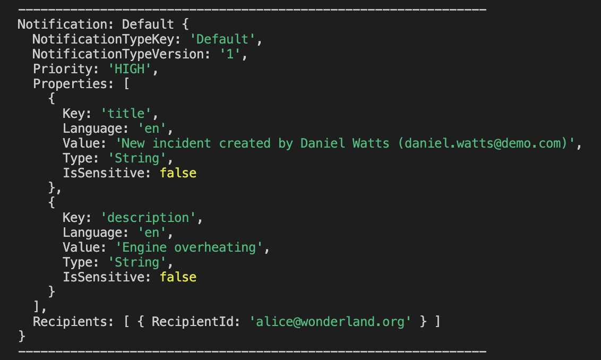
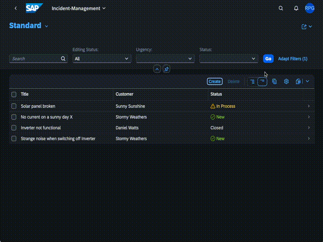

[](https://api.reuse.software/info/github.com/cap-js/notifications)

# Notifications Plugin

The `@cap-js/notifications` package is a [CDS plugin](https://cap.cloud.sap/docs/node.js/cds-plugins#cds-plugin-packages) that provides support for publishing business notifications in SAP Build Work Zone.

### Table of Contents

- [Setup](#setup)
- [Getting Started](#getting-started)
- [Running the Sample](#running-the-sample)
- [Define Notification Types](#define-notification-types)
- [Send Notifications](#send-notifications)
- [Entity Notifications](#entity-notifications)
- [API Reference](#api-reference)
- [Test-drive Locally](#test-drive-locally)
- [Run in Production](#run-in-production)
- [Advanced Usage](#advanced-usage)
  - [Custom Notification Types Path](#custom-notification-types-path)
  - [Custom Notification Type Prefix](#custom-notification-type-prefix)
  - [Custom Destination Name](#custom-destination-name)
  - [Authentication Identifier](#authentication-identifier)
  - [Default Channels](#default-channels)
  - [Outbox Behavior](#outbox-behavior)
  - [Disabling the Plugin](#disabling-the-plugin)
  - [Low-level Notifications API](#low-level-notifications-api)
- [Contributing](#contributing)
- [Code of Conduct](#code-of-conduct)
- [Licensing](#licensing)

## Setup

**Requirements:** Node.js >= 20, `@sap/cds` >= 8.

To enable notifications, simply add this self-configuring plugin package to your project:

```sh
npm add @cap-js/notifications
```

## Getting Started

After installing the plugin, you can send notifications in two ways:

### Quick start: Direct notification

Send a simple notification using `notify()`:

```js
const alert = await cds.connect.to("notifications")

await alert.notify({
  recipients: ["user@example.com"],
  title: "Book Order Received",
  description: 'Your order for "Wuthering Heights" is being processed.'
})
```

### Recommended: Define notification types

Define a notification event in your service model with `@notification`:

```cds
using { CatalogService } from './cat-service';

extend service CatalogService with {
  @notification: {
    title: 'Book {{title}} Ordered',
    subtitle: '{{buyer}} ordered {{title}}'
  }
  event BookOrdered {
    title : String;
    buyer : String;
  }
}
```

Emit the event from your service handler:

```js
this.on("submitOrder", async req => {
  // ... process order ...

  await this.emit("BookOrdered", {
    title: book.title,
    buyer: req.user.id,
    recipients: ["user@example.com"]
  })
})
```

The plugin intercepts the event and sends the notification automatically. During local development, notifications are printed to the console. No BTP connection required.

## Running the Sample

This section uses the Bookshop sample included in this repository.

### 1. Start the sample app

```sh
cd tests/bookshop
npm install
cds watch
```

The server starts at [http://localhost:4004](http://localhost:4004). During local development, the plugin prints the notifications to the console thus no BTP account is yet needed.

### 2. Trigger a notification

The bookshop's `submitOrder` action reduces book stock and emits a `BookOrderedNotify` event. The plugin intercepts that event and sends a notification.

Open `tests/bookshop/test/http/CatalogService.http` in VS Code and click **Send Request** above the `submitOrder` block. This file has the server URL and credentials pre-configured.

In the server console you will see the notification printed to confirm the notification was successful.

### 3. Customize the notification type

Open `tests/bookshop/srv/notifications.cds`. This file defines the `BookOrderedNotify` event and all of its `@notification` annotations. Change the subtitle template to include the quantity:

```cds
// Before
subtitle: '{i18n>BOOK_ORDERED_SUBTITLE}',

// After
subtitle: '{{buyer}} ordered {{quantity}}x {{title}}',
```

Save the file and `cds watch` reloads automatically. Send the request again and the updated subtitle appears in the console output. From here, try adjusting the priority expression, adding a `@description`, or exploring the other annotations on the event.

### 4. Connect to SAP Build Work Zone

To see the notification appear in the Work Zone, you need a BTP subaccount with SAP Build Work Zone and the SAP Alert Notification service configured.

1. Follow the [SAP Build Work Zone setup guide](https://help.sap.com/docs/build-work-zone-standard-edition/sap-build-work-zone-standard-edition/enabling-notifications-for-custom-apps-on-sap-btp-cloud-foundry) to subscribe to the service and configure the required `SAP_Notifications` destination in your subaccount.
2. Bind your local environment to the destination service instance in CF using `cds bind`, then run `cds watch --profile hybrid` to connect to BTP destinations from your local machine.

On startup the plugin registers your notification types automatically. Submitting an order will now deliver a notification to the bell in Work Zone for the recipient.

> [!Note]
> The bookshop sample uses in-app notifications by default. The Work Zone bell icon shows notifications for recipients identified by their SAP BTP Global User ID (UUID). To test email delivery as well, additional setup is required. For enabling, see [email delivery](#email-delivery) and [default email delivery](#default-email-delivery). For required BTP configuration see the [SMTP mail destination guide](https://help.sap.com/docs/build-work-zone-standard-edition/sap-build-work-zone-standard-edition/configuring-smtp-mail-destination).

## Define Notification Types

Notifications are based on _notification types_: templates that define how a notification looks, including titles, subtitles, and email content. These types can be defined in two ways, both of which can be used together and are merged at startup.

### Option A: CDS Annotations (recommended)

The recommended approach is to define the notification type directly in your service model by annotating events with `@notification`. The plugin discovers and registers them automatically during startup.

Define an event in your `srv/` model:

```cds
using { CatalogService } from './cat-service';

extend service CatalogService with {

  @description: 'Sent when a book is ordered'
  @notification: {
    title        : 'Book {{title}} Ordered',
    publicTitle  : 'Book Ordered',
    subtitle     : '{{buyer}} ordered {{title}}',
    groupedTitle : 'Bookshop Updates'
  }
  @Common.SemanticObject: 'Books'
  @Common.SemanticObjectAction: 'display'
  event BookOrdered {
    title : String;
    buyer : String;
  }

}
```

Any event with at least one `@notification` annotation (the bare `@notification` flag or any `@notification.*` property) is picked up. The notification type key is derived from the event name. Namespace prefixes are stripped, `my.bookshop.BookOrdered` becomes `BookOrdered`.

> [!Note]
> The plugin automatically injects a `recipients` element into every notification event at model-load time; you don't need to declare it yourself.

> [!Important]
> The event must be contained within a service either by defining it directly inside a `service` or by using `extend service` / `using` to include it in an existing one.

> [!Note]
> Annotations can also be placed in a separate file using the standard CDS `annotate` directive.

**Common annotations:**

```cds
@notification: {
  title        : 'Book {{title}} Ordered',
  publicTitle  : 'Book Ordered',
  subtitle     : '{{buyer}} ordered {{title}}',
  groupedTitle : 'Bookshop Updates', // Group header for multiple notifications
  email: {
    subject: 'Your order: {{title}}',
    html   : './email-template.html' // Path to HTML template or inline HTML
  },
  priority: #HIGH // Priority: LOW, NEUTRAL, MEDIUM, HIGH
}
event BookOrdered { ... }
```

For a complete list of supported annotations and their mappings, see [Annotation Reference](#annotation-reference).

#### Delivery channels (Option A only)

Use `@notification.channels` to specify which channels a notification type is delivered through:

```cds
@notification: {
  title   : 'Book Ordered',
  channels: ['email']
}
event BookOrdered { ... }
```

The supported values are `email` (SAP Mail) and `workzone` (SAP Build Work Zone). If no channel is specified, the channel defaults to the value of `cds.env.requires.notifications.channels`, or `workzone` if nothing is set.

#### i18n support (Option A only)

The `@notification` annotation values support `{i18n>key}` syntax. Keys are automatically resolved against your project's i18n bundles at startup. Templates are generated for each locale where at least one translation differs from the default language.

```cds
@notification.title:    '{i18n>BOOK_ORDERED_TITLE}'
@notification.subtitle: '{i18n>BOOK_ORDERED_SUBTITLE}'
event BookOrdered { ... }
```

#### HTML email templates (Option A only)

The `email.html` annotation accepts either an inline HTML string or a path to an `.html` file relative to the `.cds` source file. The file is read at startup and i18n placeholders within it are resolved.

```cds
@notification: {
  email: {
    subject: 'Your order: {{title}}',
    html   : './book-ordered-email.html'
  }
}
event BookOrdered { ... }
```

#### Priority (Option A only)

Notifications can be assigned different priority levels: `LOW`, `NEUTRAL` (default), `MEDIUM`, or `HIGH`. These priorities affect how notifications are displayed and sorted in SAP Build Work Zone.

Priorities can be set statically using `#` enum values, or dynamically using [CDS Expression Language (CXL)](https://cap.cloud.sap/docs/cds/cxl) with conditions evaluated at runtime.

**Static priority:**

```cds
@notification.priority: #HIGH
event BookOrdered { ... }
```

**Dynamic priority:**

Priority can be computed at runtime from event data using CDS ternary expressions evaluated against the database:

```cds
@notification.priority: (quantity > 5 ? #HIGH : #LOW)
event BookOrdered {
  quantity : Integer;
  title    : String;
}
```

Complex expressions using CDS functions are also supported:

```cds
@notification.priority: (days_between(orderDate, deliveryDate) > 7 ? #HIGH : #LOW)
event LateDelivery {
  orderDate    : Date;
  deliveryDate : Date;
}
```

Dynamic priority requires the event to be emitted via `this.emit(...)` so the plugin can intercept and evaluate it.

#### Build integration

Running `cds build` processes all `@notification` annotated events and generates a merged `notification-types.json` to the build output, combining types from CDS annotations with any types from the JSON file.

### Option B: JSON file

An alternative approach is to define notification types statically in `srv/notification-types.json` or custom path (see [Custom Notification Types Path](#custom-notification-types-path)):

```json
[
  {
    "NotificationTypeKey": "BookOrdered",
    "NotificationTypeVersion": "1",
    "Templates": [
      {
        "Language": "en",
        "TemplatePublic": "Book Ordered",
        "TemplateSensitive": "Book '{{title}}' Ordered",
        "TemplateGrouped": "Bookshop Updates",
        "TemplateLanguage": "mustache",
        "Subtitle": "{{buyer}} ordered {{title}}."
      }
    ]
  }
]
```

> [!Note]
> i18n resolution, HTML file paths, and priority annotations (`@notification.priority`) are only available when using CDS annotations (Option A). The JSON file format uses pre-resolved strings.

### Email delivery

Email delivery can be configured for notification types in both approaches. It requires the SAP Alert Notification Service with the `business-notifications` plan and a configured [SMTP mail destination](https://help.sap.com/docs/build-work-zone-standard-edition/sap-build-work-zone-standard-edition/configuring-smtp-mail-destination).

> [!Warning]
> The `business-notifications` plan validates **all** of your notification types at registration time, not only the ones with email. This means every notification type in your app, even purely in-app ones, must have `TemplatePublic` (mapped from `publicTitle`) and `TemplateGrouped` (mapped from `groupedTitle`) set, or startup registration will fail.

**Via CDS annotations:**

```cds
@notification: {
  title        : 'Book {{title}} Ordered',
  publicTitle  : 'Book Ordered',
  subtitle     : '{{buyer}} ordered {{title}}',
  groupedTitle : 'Bookshop Updates',
  email: {
    subject: 'Your order: {{title}}',
    html   : './book-ordered-email.html'
  },
  channels: ['email']
}
event BookOrdered { ... }
```

**Via JSON:**

```json
{
  "NotificationTypeKey": "BookOrdered",
  "Templates": [
    {
      "Language": "en",
      "TemplatePublic": "Book Ordered",
      "TemplateSensitive": "Book '{{title}}' Ordered",
      "TemplateGrouped": "Bookshop Updates",
      "TemplateLanguage": "mustache",
      "EmailSubject": "Your order: {{title}}",
      "EmailHtml": "<p>Thanks for ordering <b>{{title}}</b>!</p>"
    }
  ],
  "DeliveryChannels": [{ "Type": "MAIL", "Enabled": true, "DefaultPreference": true, "EditablePreference": true }]
}
```

> **Note:** `Enabled`, `DefaultPreference`, and `EditablePreference` are required ANS fields. Use the values as shown above without changing them.

## Send Notifications

There are two patterns for sending notifications.

### Pattern 1: Emit a CDS event (recommended)

If you defined your notification type as a CDS event with a `@notification` annotation, the plugin hooks into your service automatically. Simply emit the event from your service handler.

```js
this.on("submitOrder", async req => {
  const book = await SELECT.one.from("Books").where({ ID: req.data.book })

  await this.emit("BookOrdered", {
    title: book.title,
    buyer: req.user.id,
    recipients: ["reader@bookshop.example"]
  })
})
```

The plugin registers an event handler which forwards the notification to ANS. You can still register your own event handlers if you need to process the event yourself. The plugin's handler runs alongside them.

### Pattern 2: Call notify() directly

You can also connect to the notification service and call `notify()` directly. This works with or without pre-defined notification types.

**Simple notification** (no pre-defined type needed):

```js
const alert = await cds.connect.to("notifications")

await alert.notify({
  recipients: [...readers()],
  priority: "HIGH",
  title: "New book arrived!",
  description: "Book 'Wuthering Heights' has been added to the catalog."
})
```

> [!Note]
> The simple API supports only `recipients`, `priority`, `title`, and `description`. For advanced properties use a named notification type or the [low-level API](#low-level-notifications-api).

**Named notification type:**

```js
await alert.notify("BookOrdered", {
  recipients: [buyer.id],
  data: {
    title: book.title,
    buyer: buyer.name
  }
})
```

### Batch notifications

It is possible to pass an array to `notify()` to send multiple notifications in a single call. This triggers only one outbox event, reducing the number of transactions when notifying many recipients. If some items fail, the successful ones are still delivered. Failures are logged as warnings, and the call only throws if **all** items fail.

```js
alert.notify("BookOrdered", [
  { recipients: [buyer1.id], data: { title: book.title, buyer: buyer1.name } },
  { recipients: [buyer2.id], data: { title: book.title, buyer: buyer2.name } }
])
```

> [!Warning]
> Batch sending is only available via `notify([...])`. CDS event emission dispatches one event per call.

Alternatively, the default notification template can be used:

```js
await alert.notify([
  { type: "BookOrdered", recipients: [buyer1.id], data: { title: book1.title, buyer: buyer1.name } },
  { type: "BookOrdered", recipients: [buyer2.id], data: { title: book2.title, buyer: buyer2.name } }
])
```

## Entity Notifications

Entity notifications let you declaratively fire notifications when entity data is read or changed, without writing any handler code. Add a `@notifications` annotation directly to a CDS entity, each entry in the array defines one notification:

```cds
service CatalogService {
  @notifications: [{
    type      : 'BookOrdered',
    on        : ['READ'],
    recipients: ($self.createdBy),
    where     : ($self.stock < 5),
    priority  : #High
  }]
  entity Books as projection on my.Books;
}
```

### Annotation properties

| Property     | Required | Description                                                                 |
| ------------ | -------- | --------------------------------------------------------------------------- |
| `type`       | yes      | The name for this notification type (e.g. 'BookOrdered'). The plugin registers it automatically. |
| `on`         | yes      | Array of CDS events to listen on: `'READ'`, `'CREATE'`, `'UPDATE'`, `'DELETE'` |
| `recipients` | yes      | Field reference (e.g. `$self.createdBy`) or literal recipient identifier    |
| `where`      | no       | Filter expression: only entities matching this condition fire a notification |
| `priority`   | no       | `#Low`, `#Neutral`, `#Medium`, or `#High`                                   |
| `parameters` | no       | Explicit mapping of notification template placeholders to entity fields     |

### Notification properties

By default, all entity fields are passed to the notification template. Use `parameters` to map only specific fields instead:

```cds
@notifications: [{
  type      : 'BookOrdered',
  on        : ['READ'],
  recipients: ($self.createdBy),
  parameters: { bookTitle: $self.title, bookId: $self.ID }
}]
entity Books as projection on my.Books;
```

This produces a notification with only the `bookTitle` and `bookId` properties set, matching the placeholders in the notification type template.

## API Reference

### Simple Notification

For `notify({ recipients, title, ... })`, no pre-defined notification type is needed. The plugin uses a built-in `Default` template.

| Parameter     | Required | Description                                                                        |
| ------------- | -------- | ---------------------------------------------------------------------------------- |
| `recipients`  | yes      | Array of recipient identifiers: email addresses or SAP BTP Global User IDs (UUIDs) |
| `title`       | yes      | Notification title string                                                          |
| `priority`    | no       | `LOW`, `NEUTRAL` (default), `MEDIUM`, or `HIGH`                                    |
| `description` | no       | Subtitle text                                                                      |

### Named Notification Type

For `notify('TypeKey', payload)` or `notify({ type: 'TypeKey', ... })`, a notification using a pre-defined notification type is sent.

| Parameter    | Required | Description                                                                        |
| ------------ | -------- | ---------------------------------------------------------------------------------- |
| `recipients` | yes      | Array of recipient identifiers: email addresses or SAP BTP Global User IDs (UUIDs) |
| `type`       | yes      | Notification type key (e.g. `'BookOrdered'`)                                       |
| `data`       | no       | Key-value pairs used to fill mustache placeholders in the type template            |
| `priority`   | no       | `LOW`, `NEUTRAL` (default), `MEDIUM`, or `HIGH`                                    |

> **Note:** Recipients can be email addresses (e.g. `user@example.com`) or SAP BTP Global User IDs (UUID format, e.g. `a1b2c3d4-...`). In `auto` mode (default), the plugin detects the format per recipient and uses the correct key automatically. See [Authentication Identifier](#authentication-identifier) for details.

### Validation

- **Property values** must not exceed **255 characters**. Longer values cause the notification to be rejected.
- **TargetParameters values** longer than **250 characters** are silently dropped.
- **Event element names** must not exceed **128 characters**. Violations are caught at `cds build` time.

### Annotation Reference

Complete mapping of CDS annotations to notification fields:

| Annotation                     | ANS Field                | Description                                     |
| ------------------------------ | ------------------------ | ----------------------------------------------- |
| `@description`                 | `Description`            | Notification type description                   |
| `@notification.title`          | `TemplateSensitive`      | Main notification title (supports placeholders) |
| `@notification.publicTitle`    | `TemplatePublic`         | Public fallback title                           |
| `@notification.subtitle`       | `Subtitle`               | Subtitle text                                   |
| `@notification.groupedTitle`   | `TemplateGrouped`        | Group header for multiple notifications         |
| `@notification.email.subject`  | `EmailSubject`           | Email subject line                              |
| `@notification.email.html`     | `EmailHtml`              | Inline HTML or path to `.html` file             |
| `@Common.SemanticObject`       | `NavigationTargetObject` | Navigation target object                        |
| `@Common.SemanticObjectAction` | `NavigationTargetAction` | Navigation action                               |
| `@notification.priority`       | `Priority`               | `LOW`, `NEUTRAL`, `MEDIUM`, or `HIGH`           |

## Test-drive Locally

During local development, notifications are mocked and printed to the console. No external service is required.



## Run in Production

### Notification Destination

As a prerequisite, configure a [destination](https://help.sap.com/docs/build-work-zone-standard-edition/sap-build-work-zone-standard-edition/enabling-notifications-for-custom-apps-on-sap-btp-cloud-foundry#configure-the-destination-to-the-notifications-service) named `SAP_Notifications` in your BTP subaccount. The plugin uses this destination by default to connect to the notification service in hybrid and production environments.

### Notification Type Registration

Notification types are automatically registered and kept in sync with the notification service each time the application starts. Any additions, changes, or removals to your notification types, whether from CDS annotations or the JSON file, are applied on the next startup. No manual `cds build` or content deployment step is required.

### Integrate with SAP Build Work Zone

Once the application is deployed and integrated with SAP Build Work Zone, notifications appear under the Fiori notifications icon.



## Advanced Usage

### Custom Notification Types Path

The plugin reads `srv/notification-types.json` as the default JSON types file. To use a different path:

```json
"cds": {
  "requires": {
    "notifications": {
      "types": "srv/my-notification-types.json"
    }
  }
}
```

### Custom Notification Type Prefix

To make notification type keys unique per application, the plugin prefixes them with the application name from `package.json` by default. To use a custom prefix:

```json
"cds": {
  "requires": {
    "notifications": {
      "prefix": "my-custom-prefix"
    }
  }
}
```

### Custom Destination Name

To override the default `SAP_Notifications` destination name:

```json
"cds": {
  "requires": {
    "notifications": {
      "destination": "MY_CUSTOM_DESTINATION"
    }
  }
}
```

### Authentication Identifier

`cds.env.requires.notifications.authenticationIdentifier` controls which recipient key is used when publishing notifications.

- `auto` (default): the recipient key is chosen per recipient. Values in UUID format are treated as SAP BTP Global User IDs and published with `GlobalUserId`; everything else is published with `RecipientId`. A warning is logged if a value is neither a UUID nor an email address. This allows mixing UUIDs and email addresses in the same `recipients` array without any configuration.
- `UserUUID`: always use `GlobalUserId`. Use this when the Work Zone authentication identifier is set to `User ID`.
- `RecipientId`: always use `RecipientId`. Use this when recipients are identified by email or login name.

> [!NOTE]
> For email notifications sent with a User ID, a destination to the Identity Directory Service (IDS) must be configured for the email address lookup.

For Work Zone authentication identifier configuration, see [Work Zone Subaccount Settings](https://help.sap.com/docs/build-work-zone-standard-edition/sap-build-work-zone-standard-edition/subaccount-settings).

### Default Channels

By default, all notification types use the workzone channel. To change the default for all types that don't have a `channels` annotation, set `channels` in your configuration:

```json
"cds": {
  "requires": {
    "notifications": {
      "channels": ["email"]
    }
  }
}
```

Multiple channels are also supported:

```json
"notifications": {
  "channels": ["email", "workzone"]
}
```

Per-event `channels` annotations always take precedence over this global default.

### Outbox Behavior

By default, the notification service uses an outbox (`outbox: true`): `notify()` resolves as soon as the message is queued, not when it has been sent to ANS. This means the HTTP response from ANS is not returned. To send synchronously and receive the HTTP response:

```json
"cds": {
  "requires": {
    "notifications": {
      "outbox": false
    }
  }
}
```

### Disabling the Plugin

To disable the plugin without removing it, set `enabled: false`:

```json
"cds": {
  "requires": {
    "notifications": {
      "enabled": false
    }
  }
}
```

This prevents the plugin from registering its hooks which results into no automatic `this.emit()` interception, no notification type registration, and no build task. Direct calls to `cds.connect.to('notifications').notify()` are not affected by this flag.

### Low-level Notifications API

For full control, pass the complete notification object directly as described in the [ANS API documentation](https://help.sap.com/docs/build-work-zone-standard-edition/sap-build-work-zone-standard-edition/developing-cloud-foundry-applications-with-notifications).

#### With individual parameters

```js
alert.notify({
  recipients: [...readers()],
  type: "BookOrdered",
  priority: "NEUTRAL",
  data: {
    title: book.title,
    buyer: buyer.name
  },
  OriginId: "Example Origin Id",
  NotificationTypeVersion: "1",
  ProviderId: "/SAMPLEPROVIDER",
  ActorId: "BACKENDACTORID",
  ActorDisplayText: "ActorName",
  ActorImageURL: "https://some-url",
  NotificationTypeTimestamp: "2022-03-15T09:58:42.807Z",
  TargetParameters: [{ Key: "string", Value: "string" }] //tell Work Zone which record to open when the user clicks on the notification
})
```

#### Passing the full notification object

```js
alert.notify({
  NotificationTypeKey: "BookOrdered",
  NotificationTypeVersion: "1",
  Priority: "NEUTRAL",
  Properties: [
    { Key: "title", IsSensitive: false, Language: "en", Value: "Wuthering Heights", Type: "String" },
    { Key: "buyer", IsSensitive: false, Language: "en", Value: "reader@bookshop.com", Type: "String" }
  ],
  Recipients: [{ RecipientId: "reader1@bookshop.com" }, { RecipientId: "reader2@bookshop.com" }]
})
```

## Contributing

This project is open to feature requests/suggestions, bug reports etc. via [GitHub issues](https://github.com/cap-js/notifications/issues). Contribution and feedback are encouraged and always welcome. For more information about how to contribute, the project structure, as well as additional contribution information, see our [Contribution Guidelines](CONTRIBUTING.md).

## Code of Conduct

We as members, contributors, and leaders pledge to make participation in our community a harassment-free experience for everyone. By participating in this project, you agree to abide by its [Code of Conduct](CODE_OF_CONDUCT.md) at all times.

## Licensing

Copyright 2026 SAP SE or an SAP affiliate company and contributors. Please see our [LICENSE](LICENSE) for copyright and license information. Detailed information including third-party components and their licensing/copyright information is available [via the REUSE tool](https://api.reuse.software/info/github.com/cap-js/notifications).
